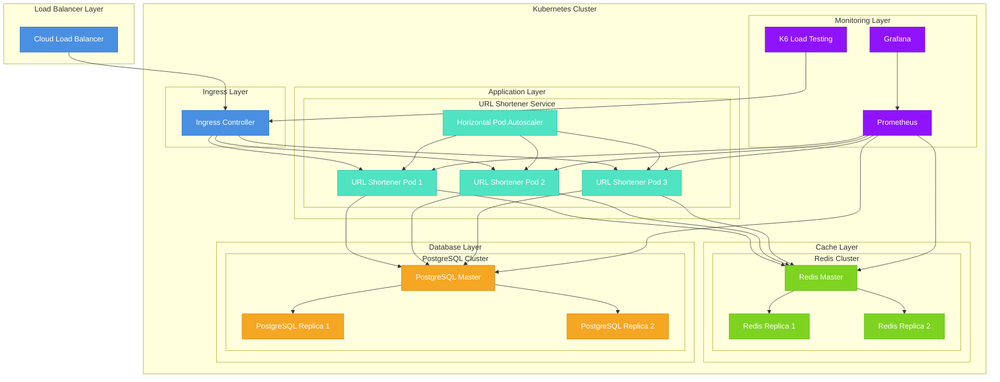

# Arquitetura de Deployment Escalável

## Diagrama de Arquitetura



## Componentes da Arquitetura

### 1. Load Balancer Layer
- **Cloud Load Balancer**: Distribui o tráfego entre os nós do cluster
- Suporte a SSL/TLS
- Health checks automáticos
- Auto-scaling baseado em demanda

### 2. Kubernetes Cluster
#### Ingress Layer
- **Ingress Controller**: Gerencia o roteamento de tráfego HTTP/HTTPS
- Configuração de regras de roteamento
- SSL termination
- Rate limiting

#### Application Layer
- **URL Shortener Service**: 
  - Múltiplos pods para alta disponibilidade
  - Horizontal Pod Autoscaler (HPA) para auto-scaling
  - Resource limits e requests configurados
  - Liveness e readiness probes

#### Cache Layer
- **Redis Cluster**:
  - Master-Replica setup para alta disponibilidade
  - Persistência de dados
  - Auto-failover
  - Cache invalidation automático

#### Database Layer
- **PostgreSQL Cluster**:
  - Master-Replica setup
  - Replicação síncrona
  - Auto-failover
  - Backup automático
  - Point-in-time recovery

#### Monitoring Layer
- **Prometheus**: Coleta métricas
- **Grafana**: Visualização e dashboards
- **K6**: Testes de carga automatizados

## Escalabilidade

### Horizontal Scaling
1. **Application Layer**:
   - Auto-scaling baseado em CPU/Memory
   - Pods distribuídos em múltiplos nós
   - Load balancing automático

2. **Cache Layer**:
   - Redis Cluster com sharding
   - Replicação para leitura
   - Cache distribuído

3. **Database Layer**:
   - Read replicas para distribuir carga de leitura
   - Connection pooling
   - Query optimization

### Vertical Scaling
- Aumento de recursos (CPU/Memory) por pod
- Otimização de configurações JVM/GC
- Ajuste de resource limits

## Alta Disponibilidade

1. **Multi-AZ Deployment**:
   - Distribuição em múltiplas zonas de disponibilidade
   - Auto-failover entre zonas
   - Data replication entre zonas

2. **Disaster Recovery**:
   - Backup automático
   - Point-in-time recovery
   - Failover automático

## Monitoramento e Observabilidade

1. **Métricas**:
   - Latência
   - Throughput
   - Error rates
   - Resource utilization

2. **Logging**:
   - Centralized logging
   - Log aggregation
   - Log analysis

3. **Alerting**:
   - Proactive alerts
   - On-call rotation
   - Escalation policies

## Segurança

1. **Network Security**:
   - Network policies
   - Service mesh
   - TLS encryption

2. **Access Control**:
   - RBAC
   - Service accounts
   - Secret management

3. **Compliance**:
   - Audit logging
   - Security scanning
   - Compliance monitoring
``` 