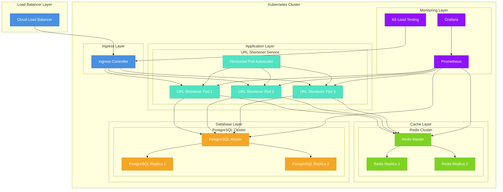

# Arquitetura de Deployment Escalável

## Diagrama de Arquitetura

```mermaid
graph TB
    subgraph "Load Balancer Layer"
        LB[Cloud Load Balancer]
    end

    subgraph "Kubernetes Cluster"
        subgraph "Ingress Layer"
            ING[Ingress Controller]
        end

        subgraph "Application Layer"
            subgraph "URL Shortener Service"
                APP1[URL Shortener Pod 1]
                APP2[URL Shortener Pod 2]
                APP3[URL Shortener Pod 3]
                HPA[Horizontal Pod Autoscaler]
            end
        end

        subgraph "Cache Layer"
            subgraph "Redis Cluster"
                REDIS1[Redis Master]
                REDIS2[Redis Replica 1]
                REDIS3[Redis Replica 2]
            end
        end

        subgraph "Database Layer"
            subgraph "PostgreSQL Cluster"
                PG_MASTER[PostgreSQL Master]
                PG_REPLICA1[PostgreSQL Replica 1]
                PG_REPLICA2[PostgreSQL Replica 2]
            end
        end

        subgraph "Monitoring Layer"
            PROM[Prometheus]
            GRAFANA[Grafana]
            K6[K6 Load Testing]
        end
    end

    %% Connections
    LB --> ING
    ING --> APP1
    ING --> APP2
    ING --> APP3
    HPA --> APP1
    HPA --> APP2
    HPA --> APP3

    APP1 --> REDIS1
    APP2 --> REDIS1
    APP3 --> REDIS1
    REDIS1 --> REDIS2
    REDIS1 --> REDIS3

    APP1 --> PG_MASTER
    APP2 --> PG_MASTER
    APP3 --> PG_MASTER
    PG_MASTER --> PG_REPLICA1
    PG_MASTER --> PG_REPLICA2

    PROM --> APP1
    PROM --> APP2
    PROM --> APP3
    PROM --> REDIS1
    PROM --> PG_MASTER
    GRAFANA --> PROM
    K6 --> ING

    %% Styling
    classDef primary fill:#4a90e2,stroke:#2171c7,color:white
    classDef secondary fill:#50e3c2,stroke:#2bb8a3,color:white
    classDef database fill:#f5a623,stroke:#d4880f,color:white
    classDef cache fill:#7ed321,stroke:#5cb315,color:white
    classDef monitoring fill:#9013fe,stroke:#6f0fc7,color:white

    class LB,ING primary
    class APP1,APP2,APP3,HPA secondary
    class PG_MASTER,PG_REPLICA1,PG_REPLICA2 database
    class REDIS1,REDIS2,REDIS3 cache
    class PROM,GRAFANA,K6 monitoring
```